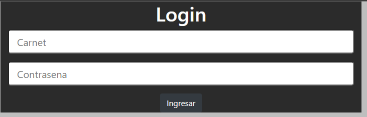
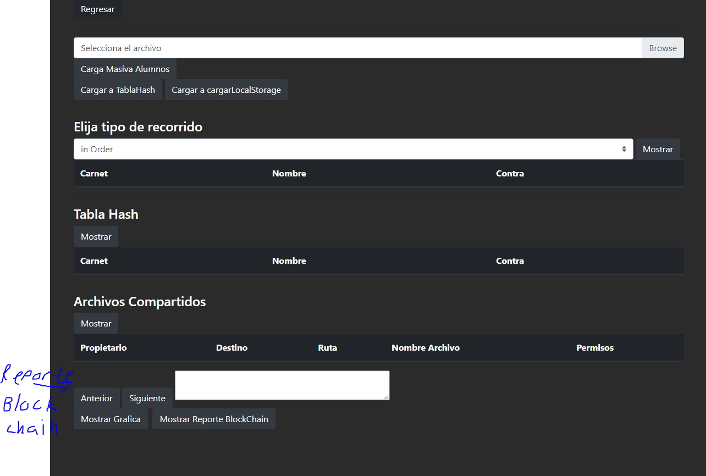
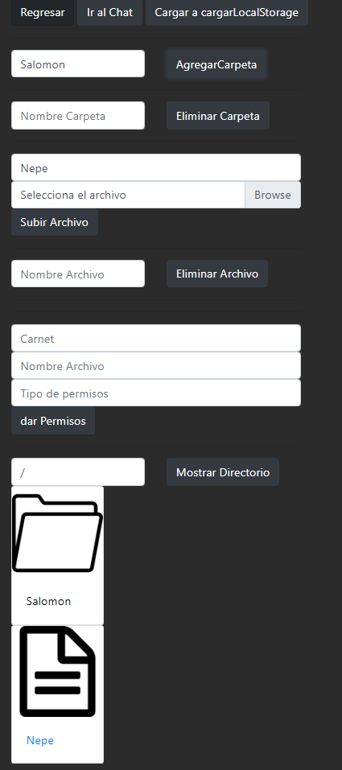
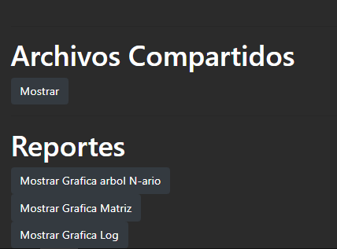

# Manual De Usuario
# Proyecto Fase 2 Estructuras De Datos

## **Objetivos e Información del Sistema**

Esta Página es un lugar para almacenar archivos importantes hecha para la Facultad de Ingeniería de la Universidad de San Carlos de Guatemala en el que se hizo uso de distintas estructuras de datos para el almacenamiento de estos archivos importantes

## Requisitos del sistema

------------
*  Procesador AMD Ryzen 5 3400G o superior
* 16 Gb Ram
* Gráficos Radeon RX 6600 o superior
* Conexión a internet
* Navegador Web

## Login
Este tiene Un Login en el que tendrán que usar su carnet como usuario he ingresar su contraseña para ingresar.
También se puede acceder a las funciones de admin si se usa como usuario admin y contraseña admin

## Interfaz Admin

En esta es posible hacer la carga de usuarios masiva con un archivo Json, también es posible visualizar los alumnos cargados en una tablaHash, asi como los reportes de archivos compartidos y de Mensajes enviados entre Usuarios.

## Interfaz Usuario

En este Aparatado el usuario es capaz de crear y eliminar distintos folderes, asi mismo con archivos; también esta la opción de compartir archivos a otros usuarios.

En usuario También tiene la Posibilidad de ver los archivos que se le han compartido, y acceso a un chat con el que puede chatear con otros usuarios.

# Manual Técnico

La página se ha hecho con **HTML** y **Boostrap** para la interfaz, y para las funcionalidades se hizo uso del lenguaje **Javascript**.

## Almacenamiento de Usuarios

El almacenamiento de usuarios se hace en un árbol AVL el cual se guarda en memoria local para la persistencia de datos. Se hizo uso de una librería recomendada por el auxiliar para permitir guardar estructuras de datos recursivas.

### Clase Est
Esta Clase guarda la información de cada Estudiante

Atributos:
---------
* Nombre ->String
* Carnet -> number
* Contraseña->String
* Bitácora->Lista Circular
* Arbol N-ario-> Arbol N-ario

### Clase NodoAVL
Esta Clase es un nodo base el cual se usa en el arbol avl
Atributos:
---------
* dato -> Object
* altura -> number
* izq->Object
* der->Object

### Clase avl

Esta es la clase de un arbol avl el cuál almacena a todos los usuarios según el carnet de cada usuario.

Atributos:
---------
* Raiz ->Object

Métodos:
---------
* **Buscar(number)**
* **getAltura(Object)**
* **maxi(object,object)**
* **insertarR(Object,Object)**->Object:
* **rotacionDer(Object)**->Object:
* **rotacionIzq(Object)**->Object:
* **preOrden(Object)**->String:
* **postOrden(Object)**->String:
* **inOrden(Object)**->String:
* **reporteGraf()**->String:
* **generarGrafNodos(Object)**->String
* **generarGrafEnl(Object)**->String

### Clase NodoM
Esta Clase es un nodo base el cual se usa en una matriz Dispersa

Atributos:
---------
* x-> number
* y -> number
* dato->Object
* right->Object
* left->Object
* up->Object
* down->Object

### Clase matrizDispersa

Esta es la clase de una Matriz dispersa para el manejo de los archivos y permisos de los archivos de cada usuario.

Atributos:
---------
* Raiz ->Object

Métodos:
---------
* **obtenerDato(Object)->Object**
* **encontrarRepetido(String)**->Boolean
* **insertarArchivo(Object)**
* **insertarPermisos(number,String,String)**->Boolean:
* **insertarNodoConxy(Object,Object,Object)**->Bolean:
* **graficarMatriz()**->String:
* **recorrerRanks()**->String:
* **recorrerNodos()**->String:
* **recorrerEnlaces()**->String:
* **crearHtmlArchivos()**->String:
* **eliminarArchivos(String)**->Boolean:
* **actualizarAlt()**

### Clase nodoLista
Esta Clase es un nodo base el cual se usa en una Lista Circular

Atributos:
---------
* dato-> Object
* sig -> Object

### Clase listaCircular

Esta es la clase de una lista circular para llevar la bitácora del usuario.

Atributos:
---------
* Encabezado->Object
* cant-> number

Métodos:
---------
* **inserta(Object)**
* **obtener(number)**->Object
* **remplazar(number,Object)**->Boolean
* **graficarLista()**->String:

### Clase nodoAN
Esta Clase es un nodo base el cual se usa en un arbol N-ario

Atributos:
---------
* dato-> Object
* matriz -> Object
* hijos-> Array
* id->Number

### Clase arbolN

Esta es la clase de un arbol N-ario para la gestión de las carpetas y archivos de cada usuario.

Atributos:
---------
* Raiz ->Object
* cant->Number

Métodos:
---------
* **agregarCarpeta(String,String)**->Boolean
* **obtenerDirectorio(String)**->Object
* **graficar()**->String
* **generarNodosGraf(Object)**->String:
* **generarEnlGraf(Object)**->String:
* **crearHTML(String,Number)**->String:
* **obtenerDotMatriz(String,number)**->String:
* **eliminarCarpeta(String,String)**->Boolean:
* **agregarArchivo(String,Object,number)**->Boolean:
* **eliminarArchivo(String,String,number)**->Boolean:
* **insertarPer(String,Number,String,String,Number)**->Boolean:

### Clase hashT

Esta es la clase de una lista Hash que la formula que usa es convirtiendo cada caracter en codigo asci y los suma, para luego usar el módulo de la capacidad de la tabla. Para coliciones, la lista usa un direccionamiento abierto por Salto al cuadrado.

Atributos:
---------
* table ->Array(7)
* capacidad->Number
* cantDatos-> Number

Métodos:
---------
* **insertar(Object)**
* **calIndice(Number,number)**->Number:
* **divisionEntera(Number,Number)**->Number:
* **aumentarTamano()**
* **numeroPrimo(Number)**->Boolean:
* **obtenerHTML**->String:
* **encriptarSha(String)**->String:
* **llenarSelect**->String:

### Clase hashT

Esta es la clase de una lista Hash que la formula que usa es convirtiendo cada caracter en codigo asci y los suma, para luego usar el módulo de la capacidad de la tabla. Para coliciones, la lista usa un direccionamiento abierto por Salto al cuadrado. En esta tabla, al mostrarla en pantalla, se encriptan las contraseñas en SHA256 para más seguridad.

Atributos:
---------
* table ->Array(7)
* capacidad->Number
* cantDatos-> Number

Métodos:
---------
* **insertar(Object)**
* **calIndice(Number,number)**->Number:
* **divisionEntera(Number,Number)**->Number:
* **aumentarTamano()**
* **numeroPrimo(Number)**->Boolean:
* **obtenerHTML**->String:
* **encriptarSha(String)**->String:
* **llenarSelect**->String:

### Clase nodoB
Esta Clase es un nodo base el cual se usa en el sistema BlockChain. El Hash se encripta en SHA256.

Atributos:
---------
* index-> Number
* timeStamp -> String
* transmitter-> String
* receiver->String
* message->String
* prevHash->String
* hash-> String

### BlockC

Esta es la clase que se encarga de el control del sistema BlockChain, usando los nodos B. 

Atributos:
---------
* raiz ->Object
* cola->Object
* cant-> Number

Métodos:
---------
* **insertar(String,String,String)**
* **obtener(Number)**->Object:
* **obtenerUltimoHash()**->String:
* **getSha256(string)**->String
* **obtenerChat(String,String)**->String:
* **graficarBlock()**->String:
* **reCalcularHashes()**:
* **obtenerTxt(Number)**->String:

